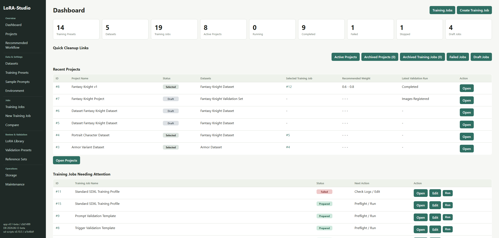
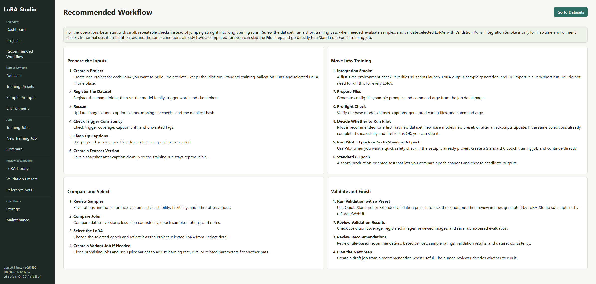
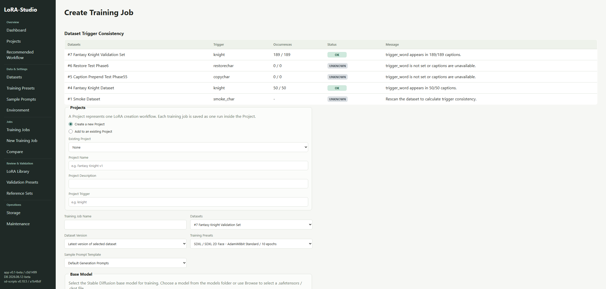
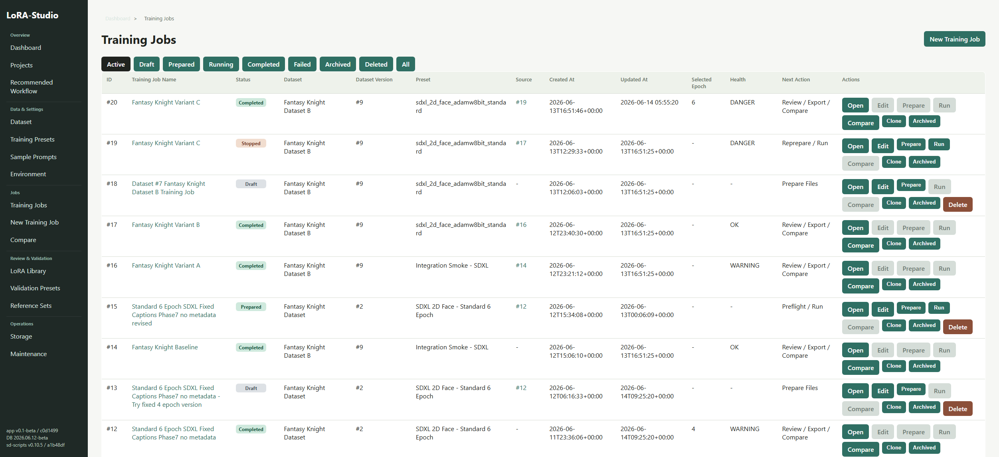
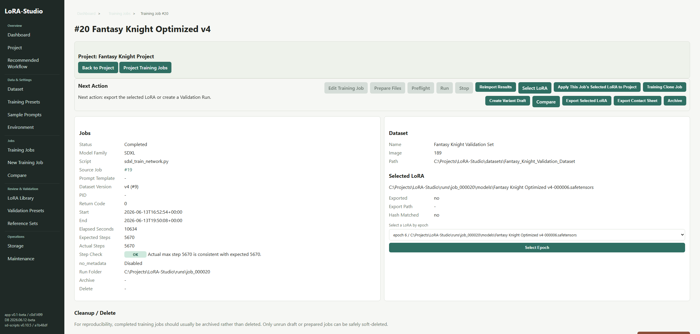

# LoRA-Studio

Stable Diffusion系LoRA、特にSDXL/SD1.5の2Dキャラクター顔LoRA学習をローカルで管理するための支援ツールです。Phase10系の運用ベータでは自動最適化ではなく、学習実験の作成、実行準備、ログ、loss健全性、サンプル画像比較、採用epoch判断、Validation、次回実験提案を一元管理することを目的にします。

現在の運用ベータ記録は `CHANGELOG.md` の `v0.2.0-beta` を参照してください。

## Screenshots

### Dashboard



Dashboardでは、最近のProject、注意が必要なJob、状態別件数、cleanup導線を確認できます。

### Recommended Workflow



Recommended Workflowでは、Dataset準備から学習、比較、検証、次回提案までの流れをカテゴリ別に確認できます。

### Create Training Job



Create Training Jobでは、Project、Dataset、プリセット、使用モデル、Sample Prompt Templateをまとめて指定します。

### Training Job Management



Training Job Managementでは、draft / prepared / running / completedなどの状態で絞り込み、Prepare、Run、Archive、Cloneを実行できます。

### Training Result Management



Training Result Managementでは、loss、step整合性、出力LoRA、サンプル画像、採用LoRAを確認します。

Screenshots are captured from sanitized English demo views for OSS submission. Labels and sample data may differ slightly from the local development UI.

## 運用ベータ範囲

- FastAPI + Jinja2 + SQLite のローカルWebアプリ
- Project単位でのLoRA作成管理
- Dataset登録、Rescan、caption整備、Dataset version管理
- 学習ジョブの作成、ファイル準備、実行、停止、ログ保存、成果物取り込み
- loss / metrics取り込み、step整合性確認、epoch別サンプル比較
- 採用LoRA選択、LoRA Library、Validation Run、Reference Set / Reference Version、評価ルーブリック
- Embedding Cache基盤、mock provider、Dataset / Reference / Sample / Validation画像のembedding coverage
- Machine Review Assist初期版、Reference Similarity、Dataset nearest similarity、overfit risk参考表示
- sd-scripts `gen_img.py` によるValidation画像生成
- 次回実験提案、Storage cleanup、Archive / Delete、Diagnostics / Backup
- 確認済みsd-scriptsバージョン `v0.10.5` の環境構築スクリプト

READMEはGitHubトップ向けに概要と主要運用をまとめています。今後、詳細手順は `docs/` 配下の getting started、workflow、dataset management、training jobs、validation、storage cleanup、troubleshooting へ分割していく予定です。

## 前提環境

- Windows 11
- Python 3.10系推奨
- Git
- NVIDIA GPU環境ではRTX 50系を想定し、初期CUDA profileは `cu128`

## アプリセットアップ

```powershell
powershell -ExecutionPolicy Bypass -File .\scripts\setup_app.ps1
```

## 起動

通常はバッチファイルから起動できます。`.venv` が未作成または依存不足の場合は、先に `scripts/setup_app.ps1` を実行してから、`.venv` のPythonでアプリを起動します。

```bat
start_lora_studio.bat
```

手動で起動する場合は以下です。

```powershell
.\.venv\Scripts\python.exe .\start_lora_studio.py
```

ブラウザで `http://127.0.0.1:8768` を開きます。

通常起動では既存プロセスを自動終了しません。
指定ポートを強制的に解放したい場合のみ `--force-release-port` を付けて起動します。
この場合も、LoRA-Studioの指定portだけを対象にします。

起動時に `external/sd-scripts` または `external/sd-scripts/venv` が未作成の場合は、`sd-scripts v0.10.5` のセットアップを自動実行します。

venv作成に使うPythonは、`data/python_cmd.txt`、`LORA_STUDIO_PYTHON_EXE` / `LORA_STUDIO_PYTHON`、環境変数から生成したPython 3.10候補、`py -3.10`、環境変数から生成したPython 3.12候補、`py -3.12`、スキャンで見つけたその他Python、PATH上の `python` の順に探します。Codex通常サンドボックスでは `py` がユーザーインストールを見つけられない場合があるため、`py` だけには依存しません。

## sd-scripts環境構築

運用ベータでは、確認済みバージョンとして `kohya-ss/sd-scripts` の `v0.10.5` を固定して使用します。

```powershell
powershell -ExecutionPolicy Bypass -File .\scripts\setup_sd_scripts.ps1 -ReleaseTag v0.10.5 -CudaProfile cu128 -MixedPrecision bf16
```

このスクリプトは `external/sd-scripts` にcloneまたはfetchし、tag `v0.10.5` をcheckoutします。運用ベータで確認している対応commitは `a1b48df` です。

アプリだけを起動して `sd-scripts` セットアップをスキップしたい場合は、検証用に以下を使えます。

```powershell
.\.venv\Scripts\python.exe .\start_lora_studio.py --skip-sd-scripts-setup
```

Pythonを手動指定したい場合は、以下のいずれかを使えます。

```powershell
# 1回だけ指定する場合
powershell -ExecutionPolicy Bypass -File .\scripts\setup_sd_scripts.ps1 -PythonCmd "C:\path\to\python.exe"

# アプリ設定として保存する場合
Set-Content -Encoding UTF8 .\data\python_cmd.txt "C:\path\to\python.exe"
```

## 初回学習の流れ

1. Environment画面で `sd-scripts` の設定方針を確認する。
2. Datasets画面で画像フォルダを登録する。Windowsでは `参照` ボタンからフォルダ選択ダイアログを開けます。
3. Dataset詳細画面で画像、caption、trigger word、タグ傾向を検査する。
4. Presets画面で初期プリセットを確認する。
5. New Job画面で新しいProjectを作成し、データセット、プリセット、使用モデル、必要ならSample Prompt Templateを指定して最初のdraft Jobを作る。
6. Job詳細画面で `ファイル準備` を押し、設定ファイルと実行コマンドを生成する。
7. `実行` を押して学習を開始する。必要なら `停止` で停止する。
8. 完了後、Job詳細画面でログ、出力LoRA、サンプル画像を確認する。手動で再取り込みしたい場合は `Reimport Results` を押す。

## ProjectとJob

- Projectは、1つのLoRA作成作業全体を表します。
- Jobは、Project内の1回の学習実行を表します。
- 軽量確認から標準学習へ進む時は、同じProject内に新しいdraft Jobを作成します。
- 実行済みJobは履歴保護のため直接編集せず、複製または派生draftを作成します。
- Project詳細を見ると、Training Jobs、採用LoRA、LoRA Profile、外部検証、次回実験提案をまとめて確認できます。
- 過去Jobを開いた場合も、Job詳細上部にProjectと現在の採用Jobへのリンクが表示されます。

`Prepare Files` では表示用の `command.txt` に加えて、実行用の `command_argv.json` を生成します。実行時はshell文字列ではなくargv配列を `subprocess.Popen` に渡すため、Windowsのスペース入りパスでも壊れにくくしています。`dataset_config.toml` の `batch_size` はプリセットの `train_batch_size` から生成し、コマンドライン側では `--train_batch_size` を重複指定しません。学習時のbatch sizeは `dataset_config.toml` を正とします。

## 基本操作導線

ジョブ作成後は `/jobs/{job_id}` のジョブ詳細画面が操作の中心です。ファイル準備、事前確認、実行、停止、結果の再取り込み、採用LoRA出力、Contact Sheet出力はジョブ詳細画面の操作パネルから実行します。比較画面は比較とレポート出力に集中し、実行や編集は各ジョブ詳細へ戻って行います。

Epoch設定や学習パラメータを間違えた場合は、ジョブ状態に応じて次のように扱います。

- `draft` / `prepared` / `failed` / `stopped`: ジョブ詳細の `ジョブを編集` から直接修正できます。
- `prepared` を編集した場合: 生成済みconfigが古くなるため `prepared_dirty` になり、実行前にファイル準備の再実行が必要です。
- `completed` / `running`: 再現性保護のため直接編集できません。`派生ドラフトを作成` で元ジョブから設定だけをコピーした下書きジョブを作り、そこで修正します。

状態別の主な操作は以下です。

| 状態 | 編集 | ファイル準備 | 事前確認 | 実行 | 停止 | 再取り込み / 出力 | 派生ドラフト |
| --- | --- | --- | --- | --- | --- | --- | --- |
| draft | 可 | 可 | 不可 | 原則不可 | 不可 | 不可 | 複製可 |
| prepared | 可 | 可 | 可 | 可 | 不可 | 不可 | 複製可 |
| prepared_dirty | 可 | 可 | 不可 | 不可 | 不可 | 不可 | 複製可 |
| running | 不可 | 不可 | 不可 | 不可 | 可 | 不可 | 可 |
| completed | 不可 | 不可 | 不可 | 不可 | 不可 | 可 | 可 |
| failed | 可 | 可 | 状況次第 | 可 | 不可 | Reimport可 | 複製可 |
| stopped | 可 | 可 | 状況次第 | 可 | 不可 | Reimport可 | 複製可 |

## Dataset Inspector

Datasets画面のIDリンクからDataset詳細を開くと、登録済みデータセットを再検査できます。`Rescan` は既存データを消さずに、画像数、caption数、欠損caption、壊れた画像、未対応ファイル、caption文字コード、画像サイズ、タグ集計、trigger word出現率を更新します。

Datasets画面の登録フォームでは、`参照` ボタンからWindowsのフォルダ選択ダイアログを開き、選んだフォルダの絶対パスを入力欄へセットできます。

使用する学習モデルはNew Job画面の `使用モデル` で指定します。プロジェクト直下の `models` フォルダに置いた `.safetensors` / `.ckpt` は候補として表示されます。別の場所のモデルを使う場合は、`参照` ボタンからWindowsのファイル選択ダイアログで選択できます。

`Top Caption Tags` はcaption内のカンマ区切りタグを集計したものです。キャラクター名や衣装、構図タグが想定通り多いかを確認します。`Trigger Count` は登録したtrigger wordがcaptionに何回出ているかを示します。0%の場合でも学習自体は可能ですが、trigger wordで呼び出すLoRAを作るならcaptionまたはsample prompt設計を見直してください。

未対応ファイルにはメタデータやcacheファイルも含まれます。画像とcaptionが揃っており、broken imageが0であれば、未対応ファイルが存在してもただちに問題とは限りません。

## Trigger Consistency

`trigger_word` はLoRAを呼び出すための固有タグです。caption内のtriggerとsample prompt内のtriggerが揃っていないと、学習時に覚えたタグと評価時に呼び出すタグがずれ、sample比較が無効になりやすくなります。

Dataset詳細の `Trigger Consistency` は以下の基準で表示します。

- `OK`: captionの80%以上にtrigger_wordが出現する。
- `WARNING`: captionの1-79%にtrigger_wordが出現する。
- `ERROR`: caption内のtrigger_wordが0件。
- `UNKNOWN`: trigger_word未設定、またはcaptionを解析できない。

例えば `trigger_word=testchar` が `0/50` の場合、そのtriggerで呼び出すLoRAとしては強い不整合です。この場合は、captionに既に多く含まれている固有タグをtriggerにするか、captionの先頭に独自triggerを追加します。

Dataset詳細の `Top Tag Candidates` は、`1girl`、`solo`、`looking at viewer` などの一般タグを除外し、caption内で多く出る固有タグ候補を表示します。候補の `Use this as trigger_word` を押すとDatasetのtrigger_wordを変更し、Rescanします。

独自triggerをcaptionへ追加する場合は `Prepend Trigger To Captions` を使います。必ず `Preview` で変更件数、skip件数、変更前後サンプル、backup pathを確認してから `Confirm` します。Confirm時は `backups/datasets/dataset_000004/captions_YYYYMMDD_HHMMSS/` のような場所へ元captionをコピーし、UTF-8でcaptionを書き戻します。

既存Jobは作成済みのparamsやsample promptsを自動変更しません。新規Jobでは作成時のtrigger consistency snapshotを保存します。snapshotが無い既存Jobでは、現在のDataset分析とsample prompt内triggerの使用状況を参考表示します。

`Captions Missing Trigger` では、現在のtrigger_wordを含まないcaptionを一覧できます。画像ファイル名、captionファイル名、caption previewを確認して、prepend対象が妥当か見ます。

`Caption Edit History` の `Restore Preview` では、backup_pathからcaptionを復元する前に、現在値と復元後のサンプルを確認できます。`Confirm Restore` を実行すると、backup時点のcaptionへ戻し、Rescanと新しいDataset version作成を行います。

## Dataset Version

DatasetをRescanした時やcaption編集後には `dataset_versions` に状態スナップショットを残します。versionにはtrigger_word、画像数、caption数、trigger出現数、consistency label、画像manifest hash、caption manifest hash、統計JSONを保存します。

Job作成時には、その時点の最新 `dataset_version_id` を `training_jobs` に保存します。これにより、caption整備前のJobと整備後のJobを比較するときに、どのDataset状態で学習したかを区別できます。古いJobで `dataset_version_id` が無い場合は `snapshot unavailable` と表示します。

Dataset詳細の `Dataset Versions` では、各versionのtrigger出現率とmemoを確認できます。caption編集前後を比較するときは、編集前versionと編集後versionのtrigger consistencyがどう変わったかを見てください。

## Job派生

Job詳細画面では既存Jobから `Clone Job` と `Quick Variant` を作成できます。

- `Clone Job` はデータセット、base model、プリセット、params、sample prompt templateを引き継いだdraftを作ります。成果物、metrics、sample画像はコピーしません。
- `Quick Variant` は元Jobを親として、LR、network_dim/network_alpha、epoch数など一部パラメータだけを変えたdraftを作ります。

派生Jobには `parent_job_id` が保存され、Dashboard、Job詳細、Compare画面から親Jobを確認できます。初回や新条件では軽量確認を挟むと安全ですが、PreflightがOKで同条件の完走実績がある場合は標準学習へ直行して構いません。

## Sample Prompt Template

`Prompt Templates` 画面では組み込みのsample prompt templateを確認できます。New Jobでtemplateを選ぶと、`Prepare Files` 時にtemplate内の `{trigger_word}` がDatasetのtrigger wordへ置換され、`sample_prompts.txt` と `sample_prompts` テーブルへ保存されます。

初期テンプレート `SDXL Face Basic 3 Prompts` は、顔アップ、全身、表情とポーズの3枚をepochごとに比較するためのものです。デフォルト生成promptではなく固定テンプレートを使うと、Job間比較で同じprompt同士を見比べやすくなります。

## Metrics / Loss の見方

Job詳細画面の `Metrics / Loss` では、`Reimport Results` または学習完了時の自動取り込みで集計されたlossとstep整合性を確認できます。

- `Expected Steps` は `dataset_config.toml` のsubsetごとの画像数とrepeat、プリセットのepochまたは `max_train_steps` から計算した概算です。
- `Actual Step` はTensorBoard metricsまたは `train.log` から読み取った最大stepです。
- `Step Check` はexpectedとactualが概ね一致すれば `OK`、取得不能や差が大きい場合は `WARNING`、completedなのに極端にstepが少ない場合は `ERROR` になります。
- `Health` はLoRA品質や絵の良し悪しではなく、学習ログ上のloss推移の健全性ラベルです。
- TensorBoard eventがある場合はそれを優先し、無い場合は `train.log` の `avr_loss` をfallbackとして取り込みます。

結合確認のようにstep数が極端に少ないジョブでは、loss healthは `UNKNOWN` や `DANGER` になりえます。これは品質評価ではなく、短すぎるログから見た注意表示です。

サンプル画像はJob詳細の `Samples By Prompt` にprompt別、epoch/step順で表示されます。各画像には人間確認用の `rating` と `memo` を保存できます。これはAI評価ではなく、目視メモ用途です。

`Health` が `WARNING` の場合は、`spike_count`、spike判定閾値、`loss_volatility`、`late_stage_slope`、`min_loss_step`、`final_loss`、`health_message` を確認します。`WARNING` は即不採用ではなく、lossログ上の注意表示です。サンプル画像の見た目が良い場合は採用候補になり得ます。最終的な `selected LoRA` は、loss健全性、epoch別サンプル、rating/memoを見て人間が選びます。

## 学習確認の推奨順

1. `結合確認 - SDXL`
   初回環境確認専用です。実モデルでsd-scripts起動、LoRA出力、サンプル生成、DB取り込み、画面表示を短時間で確認するため、`max_train_steps=2` の上限を使います。LoRA品質評価には使いません。

2. `SDXL 2D Face - 軽量確認 3 Epoch`
   任意の軽量確認用です。初回、新dataset、新base model、新preset、sd-scripts更新後など、不安がある条件で挟みます。50枚前後のデータセットで、おおよそ `50 images * repeats 2 * epochs 3 / batch 2 = 150 steps` を走らせ、loss推移、epochごとの差、sample比較、出力LoRA選択の導線を確認します。毎回必須ではありません。

3. `SDXL 2D Face - 汎化寄り軽量確認 3 Epoch`
   標準寄りの軽量確認より弱めの短時間確認用です。同じデータセットとbase modelで `軽量確認 3 Epoch` と比較し、固定化を避けた設定のsample差、loss推移、採用候補を確認します。

4. `SDXL 2D Face - 標準 6 Epoch`
   Dataset整備後の本番寄り短時間テストです。PreflightがOKで、同dataset version / base model / model familyの完走実績がある場合は軽量確認をスキップしてここへ直行できます。50枚前後のDatasetでは、おおよそ `50 images * repeats 2 * epochs 6 / batch 2 = 300 steps` を走らせ、epoch 4以降の過学習傾向、sample変化、採用候補epochを確認します。保存時メタデータ計算のメモリ負荷を避けるため `no_metadata` を使います。

5. `SDXL 2D Face - AdamW8bit 標準`
   軽量確認と標準 6 Epochで評価導線とおおまかな挙動を確認してから、本学習候補として使います。

`expected_total_steps` は設定とデータセットから計算した概算、`actual_max_step` はTensorBoardまたは `train.log` から読めた実stepです。差が大きい場合は、dataset_config、batch size、repeat、epoch、`max_train_steps` の指定を確認してください。

lossはraw値だけでなく、10点moving averageとepoch summaryを一緒に見ます。raw lossはsample生成や保存前後でspikeしやすいため、`raw=WARNING` でも `smoothed=OK`、`epoch=OK` なら、lossログとしては即不採用ではありません。`health_label` はLoRA品質評価ではなく学習ログの健全性評価です。画像評価とloss健全性は別軸なので、WARNINGでもsample画像が良ければ採用候補になり得ます。

Job詳細の `Epoch Summary` では、epochごとのavg/min/max/final loss、moving average final、spike count、sample count、出力LoRAを確認できます。Compare画面ではJob同士のepoch別avg lossとmoving average finalも比較できます。Dataset versionが同じJob同士を比較すると、caption条件差を避けやすくなります。

## Job比較

DashboardのRecent Jobsで2件にチェックを入れて `Compare Selected` を押すか、`/compare?job_a=4&job_b=5` のようにURLを指定すると比較画面を開けます。

比較画面では、基本情報、親Job、Dataset version、trigger at creation、プリセット、base model、採用LoRA、主要パラメータ差分、metrics差分、lossグラフ、prompt別sample画像を横並びで確認できます。標準軽量確認と汎化寄り軽量確認は、同じデータセット、同じbase modelで作成し、両方の `expected_total_steps` と `actual_max_step` が概ね一致していることを確認してからsampleを比較します。

比較対象Jobの `dataset_version_id` が異なる、または古いJobでsnapshotが無い場合は警告を表示します。caption整備前の旧Jobと整備後の新Jobは、純粋な品質比較ではなく、Dataset条件差を含む参考比較として扱ってください。`trigger_word_at_creation` が異なる場合も同様に注意が必要です。

比較結果は `Export Markdown` で `runs/comparisons/compare_job_000004_job_000005.md` のようなMarkdownへ出力できます。MarkdownにはJob ID、プリセット名、パラメータ差分、metrics差分、selected LoRA、人間メモ、health注意、sampleファイル名を記録します。

## 視覚評価ワークフロー

Job詳細の `Samples By Prompt` では、各sample画像に以下の人間評価を保存できます。

- `Face`: 顔・髪型・表情などキャラクター性の入り具合。
- `Costume`: 衣装や装飾の再現。
- `Style`: 絵柄や塗りの安定。
- `Stability`: 崩れ、破綻、固定化の少なさ。
- `Overall`: 採用判断用の総合評価。既存の `rating` は `rating_overall` と互換扱いです。
- `Memo`: 目視メモ。良い点、崩れ、採用理由などを書きます。

`Epoch Visual Summary` は、sample ratingをepoch単位で集計し、`training_epoch_summaries` のloss情報と並べて表示します。`avg_loss`、10点moving average、sample数、各rating平均、memo数、対応するLoRA出力、selected状態を同じ表で確認できます。lossが `WARNING` でも、epoch別sampleとratingが良ければ採用候補になり得ます。

### Review Queue

Job詳細の `Review Queue` は、学習完了後に全epochを眺める負担を減らすための入口です。`training_epoch_summaries` のloss、moving average、出力LoRA、sample有無、採用済みepochを使って候補epochを自動抽出します。画像内容をAI判定しているわけではなく、人間が見る順番を決める補助です。将来ChatGPT / VLM画像評価を追加する場合も、この候補や自動初期評価は人間が補正する前提です。

候補は原則として `primary`、`secondary`、`check` を中心に表示します。採用済みepochがある場合はそのepochを `primary` とし、前後epochを比較候補にします。Job #12のような標準6Epochでは、epoch 4をprimary、epoch 3をsecondary、epoch 5をcheckとして見比べる導線になります。

表示は `候補epochのみ`、`全epoch`、`未評価のみ` を切り替えられます。まず候補epochを見て、必要に応じて全epochを確認してください。候補が古い場合は `候補epochを再生成` を押します。

sample画像はクリックで拡大表示できます。full body画像は顔が小さいため、顔評価を必須にせず、全身、衣装、安定性、柔軟性を中心に見ます。評価欄の `N/A` は「この画像では評価対象にしない」という意味です。N/Aは平均計算から除外され、顔が悪い評価としては扱いません。

評価保存はページ全体をリロードしないAJAX保存です。画像ごとの `保存`、または表示中カードをまとめる `表示中の評価を一括保存` を使えます。保存後もスクロール位置は維持されます。

採用LoRAは、Outputs一覧の `Select` でも選べますが、`Set selected by epoch` からepoch単位でも選択できます。選択すると `training_outputs.selected`、`training_jobs.adopted_epoch`、`training_jobs.adopted_model_path` が更新されます。

推奨運用は以下です。

1. Job完了後に `Reimport Results` を実行する。
2. `Samples By Prompt` でepoch 3/4/5付近を目視する。
3. sample ratingとmemoを入力する。
4. `Epoch Visual Summary` で候補epochを確認する。
5. `Set selected by epoch` またはOutputs一覧でselected LoRAを決定する。
6. `Export Contact Sheet` で静的HTMLレポートを出力する。
7. `Export Selected LoRA` で採用LoRAを `exports/selected_loras/` に保存する。

## Contact Sheetと採用LoRA export

Job詳細の `Export Contact Sheet` は、`runs/job_xxxxxx/reports/contact_sheet_job_xxxxxx.html` に静的HTMLを出力します。Job基本情報、preset、Dataset version、trigger、selected LoRA、health、epoch別loss summary、prompt別・epoch別sample画像、rating/memo、画像ファイル名を含みます。画像は相対パスで参照するため、ローカルでHTMLを開いて確認できます。

Compare画面の `Export Compare Contact Sheet` は、`runs/comparisons/contact_sheet_compare_job_000010_job_000012.html` のようなHTMLを出力します。比較対象Jobの基本情報、パラメータ差分、Dataset version警告、epoch別loss比較、同prompt・同epochのsample画像、rating/memo、selected LoRAを記録します。

Job詳細の `Export Selected LoRA` は、選択済みLoRAを以下のように保存します。

```text
exports/selected_loras/
  job_000012/
    selected_model.safetensors
    selected_lora_info.json
    selected_lora_notes.md
```

`selected_lora_info.json` にはJob ID、Job名、Dataset ID/version、trigger、preset、params、selected epoch、元ファイルパス、export先、file size、sha256、health、export時刻、人間評価メモを保存します。`selected_lora_notes.md` は人間が読むための概要、trigger、Dataset version、選択epoch、loss summary、メモ、注意点です。

## 学習ジョブ / Projectの整理

学習ジョブは1回の学習実行履歴です。実行済みジョブは再現性や比較のため、原則として削除ではなくアーカイブ推奨です。アーカイブすると通常一覧からは消えますが、DB、runsフォルダ、出力LoRA、sample画像、metricsは残ります。

- `Archive`: 通常一覧から非表示にします。実行済み、比較済み、採用候補だったジョブの整理に使います。
- `Delete`: `draft` / `prepared` / `prepared_dirty` など未実行の学習ジョブ向けです。初期版では `deleted_at` を入れる論理削除で、runsファイルは削除しません。
- `Restore`: アーカイブ済みの学習ジョブやProjectを通常表示に戻します。

完了済みジョブ、selected LoRA、LoRA Libraryプロファイル、外部検証、Recommendationに紐づくジョブは削除に注意してください。採用LoRAに紐づく完了ジョブは、安全のため削除を拒否する設計です。ProjectはLoRA作成の作業単位なので、標準操作はProject Archiveです。Projectを整理してもDataset画像、caption、base model、sd-scripts環境は削除されません。

`/jobs` のフィルタで `有効`、`下書き`、`準備済み`、`実行中`、`完了`、`失敗`、`アーカイブ`、`削除済み`、`すべて` を切り替えられます。`整理候補` には古い下書き、準備済み未実行、成果物なしの失敗/停止、結合確認、未採用の軽量確認などを表示します。不要なものはアーカイブ、未実行で不要なものは削除PreviewからDBのみ削除を選びます。

## runsファイル整理とStorage Usage

LoRA学習ではepochごとに `.safetensors` とsample画像が出るため、`runs/` はすぐ大きくなります。採用LoRAを `exports/selected_loras/` やStable Diffusion側のLoRAフォルダへ移した後は、runs側の未採用LoRAや失敗Jobの出力を整理できます。

`ストレージ` 画面では、以下を確認できます。

- `runs` / `exports` / `backups` / `Trash` の合計容量。
- モデル出力、sample画像、reports/logs/configの内訳。
- Job別のモデル容量、sample容量、ログ/設定容量、採用LoRA有無、Export有無、cleanup候補。

Job詳細の `runsファイル整理` では、必ずPreviewを見てから実行します。

- `未採用LoRA削除Preview`: `training_outputs.selected = 0` のモデルだけを対象にします。採用LoRAは対象外です。
- `Export済み採用LoRAのruns側削除Preview`: Export先が存在し、sha256一致が確認できている場合だけ有効です。DBにはExport先とhash確認時刻を残します。
- `失敗/停止出力削除Preview`: failed / stoppedで採用LoRAがないJobのモデル出力を整理するためのPreviewです。
- `Sample Cleanup Preview`: sample画像をTrashへ移動します。必要なら先にContact Sheetを出力してください。

削除操作は初期版では即完全削除ではなく、`trash/files/YYYYMMDD_HHMMSS/` へ移動します。移動履歴は `file_cleanup_history` に残り、Storage画面のTrash一覧で確認できます。`Purge Trash` を押すとTrash内の実ファイルを完全削除します。

OneDrive配下で使っている場合は注意してください。LoRA-Studioのフォルダや `runs/` がOneDrive配下にあると、削除やTrash移動がクラウド側にも反映される可能性があります。また、大容量のrunsをOneDrive配下に置くと同期負荷が高くなります。

## Validation Packと実生成環境での手動検証

Job詳細の `Validation Pack出力` は、採用済みLoRAをreForge / WebUIで検証するためのファイル一式を `exports/validation_packs/job_xxxxxx/` に出力します。Packには以下が含まれます。

- `validation_prompts.md`: LoRA weight別、prompt type別の手動検証prompt。
- `validation_prompts.json`: 将来のWebUI API連携でも使いやすい構造化prompt。
- `validation_checklist.md`: 目視確認用チェックリスト。
- `lora_usage_example.txt`: reForge / WebUIでの短い使い方。
- `validation_result_template.md`: 手動検証結果の記録テンプレート。

まず `Export Selected LoRA` または `Validation Pack出力` を実行し、採用LoRAを `exports/selected_loras/job_xxxxxx/` に出力します。Validation Pack出力時にも採用LoRA exportは更新され、`selected_lora_info.json` には `validation_pack_path` が追記されます。

reForge / WebUIでは、LoRAファイルを `models/Lora` にコピーし、LoRA一覧を更新してからprompt内で `<lora:filename:weight>` を使います。promptに入れるLoRA名は `.safetensors` 拡張子を除いたファイル名です。最初は学習時と同じbase modelで確認してください。違うbase modelで試すのは、同一base modelで崩れや暴発がないことを見てからにします。

Validation Packは `0.4 / 0.6 / 0.8 / 1.0` のweightを出力します。目安は以下です。

- `0.4`: 弱すぎず、特徴が少し出るか。
- `0.6`: 自然に特徴が出るか。
- `0.8`: 顔特徴が安定するか。最初の採用候補になりやすいweightです。
- `1.0`: 崩れ、固定化、背景汚染が強くならないか。

Job詳細の `Validation Results` では、手動生成した画像の評価を記録できます。`prompt_type`、`weight`、顔、衣装、安定性、柔軟性、総合、メモ、任意の `image_path` を保存します。保存した結果から、weight別・prompt_type別の平均スコア、`best_weight_by_overall`、`best_weight_by_stability` を表示します。best weightは自動採用ではなく、人間が画像とメモを見て判断するための補助値です。

## External ValidationとLoRAライブラリ

Job詳細の `External Validation` では、reForge / WebUIなど外部生成環境で作成したValidation画像を、採用LoRAに紐づけて保存できます。保存できる主な項目は、画像パス、validation type、prompt、negative prompt、base model、sampler、steps、CFG、画像サイズ、Hires設定、LoRA weight、seed、顔/衣装/スタイル/安定性/総合rating、推奨weight範囲、メモです。

評価入力は `evaluation_rubrics` の active schemaに沿って、rating 1〜5に加えて、強さ、過学習、採用判断、failure tagsを定型項目として保存します。memoは任意補足です。これにより、自由文の揺れに左右されず、提案エンジンが評価を利用できます。将来ChatGPT画像評価を追加する場合も、このrubric schemaに従ったJSONを保存する想定です。現時点ではChatGPT API連携は行いません。

同じセクションの `weight別評価` では、画像1枚単位ではなくLoRA weight単位の評価を記録できます。`0.4` をlight、`1.0` をstrongのように扱い、`recommended_weight_min / recommended_weight_max` で実用時の推奨範囲を保存します。

採用LoRAを選択すると `selected_lora_profiles` にLoRA Profileが作成され、`LoRAライブラリ` 画面からJob横断で一覧できます。Profile編集画面ではtrigger、base model、推奨weight、light/strong weight、validation memo、library memoを調整できます。Job単位の結果確認から、実際に使うLoRAのライブラリ管理へ移すための画面です。

`Export Contact Sheet` と `selected_lora_notes.md` にはExternal ValidationのProfile、weight評価、Validation画像情報も追記されます。外部生成環境での目視結果を、学習時のlossやsample ratingと一緒に残せます。

## Validation PresetとReference Set

検証プリセットは、reForge / WebUIなど外部生成環境で人間が検証画像を作る時の標準条件です。LoRA-Studioは現時点ではWebUI / reForge APIによる自動txt2img生成は行いません。prompt、seed、weight、Hires条件を固定したプロンプトパックを出力し、生成後の画像を検証ランへ登録できます。

一方で、sd-scripts `gen_img.py` を使った標準Validation画像生成には対応しています。これはWebUI / reForge API連携ではなく、LoRA-Studioが管理するsd-scripts環境で検証画像を生成する機能です。

built-in presetは以下の3段階です。

- `クイック検証 v1`: 3 prompts × 1 seed × 3 weights × Hiresなし = 9枚。採用LoRAが使えそうかを短時間で確認します。
- `標準検証 v1`: 3 prompts × 3 seeds × 5 weights × Hiresなし = 45枚。採用候補LoRAの標準比較です。推奨weightは原則としてこのHiresなし結果を基準にします。
- `拡張検証 v1`: 3 prompts × 2 seeds × 2 weights × Hiresあり/なし = 24枚。採用候補の最終見栄え確認です。

標準比較はHiresなしで行います。Hiresありは最終見栄え確認であり、Hiresなしの素のLoRA比較とは直接混ぜて判断しません。seedは固定で構いません。weightを毎回細かく刻みすぎると生成時間が増えるため、まずはクイック検証、採用候補なら標準検証、最後に拡張検証の順で確認します。

Job詳細またはLoRA Profile編集画面の検証ラン作成からプリセットを選ぶと、`exports/validation_runs/validation_run_xxxxxx/` に以下を出力します。

- `validation_prompts.md`: WebUI / reForgeでそのまま使えるprompt一覧。
- `validation_prompts.json`: 将来のWebUI API連携や自動処理でも使いやすい構造化条件。
- `validation_conditions.json`: condition hash付きの全条件。
- `validation_grid_plan.md`: weight × seedなどのGrid作成方針。
- `validation_checklist.md`: 目視確認用チェックリスト。

検証ラン詳細では、個別画像またはGrid画像を登録できます。個別画像はprompt_key、seed、weight、Hires条件から `condition_hash` を作り、同一条件比較に使います。Grid画像は資料として登録でき、初期版では自動分割しません。条件が違うValidation画像は直接比較せず、画面上の警告を確認してください。

### sd-scripts Validation Generation

検証ラン詳細の `sd-scripts画像生成` では、Expected Conditionsから `gen_img.py` 用のprompt fileと `command_argv.json` を作成し、LoRA-StudioからValidation画像を生成できます。Standard Validation v1の45枚をWebUI / reForgeで手作業生成する負担と、seed / weight / prompt / base modelの入力ミスを減らすための機能です。

生成ファイルは `exports/validation_runs/validation_run_xxxxxx/generation/` に出力されます。

- `validation_prompts_for_sd_scripts.txt`: Hiresなし条件をまとめた確認用prompt file。
- `validation_prompts_baseline_for_sd_scripts.txt`: weight 0 baseline用。LoRAをロードしないコマンドで使います。
- `validation_prompts_lora_for_sd_scripts.txt`: weight > 0用。`--network_module networks.lora` と `--network_weights` を使います。
- `command.txt`: 人間確認用のコマンド表示。
- `command_argv.json`: 実行用のargv配列。shell文字列ではなくこの配列を使って実行します。
- `images/`: 生成画像の出力先。

weight 0 baselineは標準ではLoRAなしのベースモデル比較として扱います。そのためbaseline用コマンドには `--network_weights` を入れず、prompt行にも `--am` を付けません。weight > 0の条件ではLoRAをロードし、prompt行の `--am` でweightを指定します。

初期版ではHiresなしのQuick / Standardを優先します。Hiresあり条件は `Hires generation not implemented yet` としてskipします。sd-scriptsのHighres fixを使ったとしてもWebUI / reForgeと完全一致しない可能性があるため、最終運用確認はreForge / WebUIで少数行ってください。

生成完了後は `images/` をスキャンして `validation_images` へ自動登録し、ファイル名内の `expected_condition_id` / `condition_hash` からExpected Conditionへ紐づけます。Coverage Matrixは自動更新され、`validation_matrix.html` には prompt_keyごと、seed × weightごとの一覧が出力されます。生成には時間がかかるため、まず `クイック検証 v1`、採用候補が固まったら `標準検証 v1`、最後に必要なら `拡張検証 v1` の順で使ってください。

検証ラン詳細の `Coverage Matrix` は、Presetが期待する全条件に対して、画像登録済み、Rubricレビュー済み、未登録、ignoredを一覧します。`weight 0` はLoRAタグを付けないbaseline条件です。baselineは比較基準としてレビューできますが、推奨weight計算の候補には入れません。

登録画像のレビューは、rating 1〜5、強さ、過学習、採用判断、failure tagsを中心に入力します。memoは補足です。`Weight Review Matrix` ではweight、prompt、seed、Hires別に評価分布を確認できます。個別画像は期待条件に紐づくとCoverageに反映され、Grid画像は比較資料として保持されます。

`推奨weight` はHiresなしのクイック検証/標準検証結果を優先し、`too_weak`、`too_strong`、`broken`、`reject` を除外して計算します。評価済み条件が少ない場合は既存Profile/Runの推奨weightを維持します。`Profileへ反映` は人間が押した時だけ `selected_lora_profiles` に保存し、検証ランを完了扱いにします。

`検証レポート出力` は `exports/validation_runs/validation_run_xxxxxx/validation_report.md` に、Coverage、推奨weight、Weight Review Matrix、登録画像、注意事項をMarkdownで保存します。LoRAライブラリ画面では最新検証ランのstatus、coverage、レビュー不足警告を確認できます。

### Reference Set

Reference Setは、人間評価時に見る参考画像の固定セットです。Dataset、Project、LoRA Profile、Validation Runに紐づけて、顔正面、上半身、全身、表情、スタイル、背景などの参照画像を登録できます。

Reference SetはMachine Review Assistの基準画像としても使います。画像とcaption snapshot、役割、メモ、Reference Versionを固定し、あとからsample画像やValidation画像との類似度を同じ基準で確認できるようにします。

Reference SetにはVersionがあります。既存のReference Setは初回migrationで `v1` に変換され、画像は `reference_set_versions` に紐づきます。Projectの標準Reference Setにすると、そのProjectから作るLoRA ProfileやValidation RunにReference Set / Versionを引き継げます。あとからReference Setを更新しても、過去のValidation Runがどの基準で見られたか追いやすくなります。

Completenessは、画像数と役割の偏りを確認する補助表示です。Characterでは顔正面・上半身・全身、Styleでは寄り・上半身・全身・背景などの役割を見ます。`OK` は最低限の役割が揃っているという意味で、品質評価や採用判断ではありません。

リファレンスセット詳細では、データセット候補から画像を追加したり、外部画像を管理ディレクトリへコピーして登録できます。Contact Sheet HTMLとMarkdown Reportは `exports/reference_sets/reference_set_xxxxxx/` に出力されます。

### Embedding Cache

Embedding Cacheは、Dataset、Reference、Sample、Validation画像をCLIP等の特徴ベクトルへ変換し、後から類似度計算やMachine Review Assistに使うためのキャッシュです。embeddingの計算、`.npy` 保存、stale / missing / failed管理、coverage表示、Reference Similarity計算の土台として使います。

Providerは差し替え可能な設計です。

- `mock`: テスト用の決定論的provider。画像hashから512次元の疑似ベクトルを作り、外部モデルやdownloadは不要です。
- `open_clip`: 任意provider。依存が未導入の場合はWARNING表示になります。
- `transformers_clip`: 任意provider。依存が未導入の場合はWARNING表示になります。

Embedding設定は `Embedding設定` 画面で管理します。初期値は `mock_image_512`、cache rootは `data/embeddings`、自動downloadはOFFです。実モデルproviderは初回モデルdownloadやGPU/VRAMを使う可能性があるため、trainingやsd-scripts画像生成と同時にGPU embeddingを動かさない運用を推奨します。

推奨運用は、Reference Setを整備し、Reference Embeddings、Dataset Embeddings、Sample / Validation Embeddingsの順に計算しておくことです。

### Machine Review Assist

Machine Review Assistは、embeddingが存在するsample画像やValidation画像について、Reference SetとDataset画像との類似度を計算し、レビュー時の参考情報として表示する機能です。機械補助判定は参考情報であり、最終判断は人間評価を優先してください。

- `Reference Similarity`: Reference Set画像との平均類似度、最大類似度、最も近いReference画像を表示します。採用候補epochやValidation weightを見る時の補助情報です。
- `Dataset Nearest Similarity`: Dataset Version内の画像との最近傍類似度とtop1 marginを表示します。1枚の学習画像に極端に近い場合は、構図固定や過学習の疑いとして参考にします。
- `Overfit Risk`: Dataset nearest similarityとtop1 marginから `low` / `medium` / `high` / `unknown` を出します。品質評価ではなく、確認すべき候補を目立たせるためのラベルです。
- `Assist Label`: Reference similarity、overfit risk、confidenceを合わせて `primary_candidate`、`secondary_candidate`、`possible_overfit`、`low_confidence` などを表示します。自動採用は行いません。

`mock_image_512` providerは機能経路テスト用です。画像の意味を理解するembeddingではないため、mock providerのスコアは意味的な画像評価には使えません。mock provider使用時はconfidenceを低く表示し、Recommendation Engineの強い提案材料にはしません。

Reference Setが1枚だけの場合、判定がその画像に偏る可能性があります。キャラクターLoRAでは3〜5枚、画風LoRAでは6〜12枚程度のReference画像を推奨します。Datasetが100枚を超える場合も初期版では全件比較しますが、将来は近似検索などで最適化する予定です。

Job詳細とValidation Run詳細には `機械補助レビュー準備状況` パネルがあります。ここではReference Setの枚数、Reference / Dataset / Sample / Validation画像のEmbedding coverage、Machine Review score coverage、provider、confidence warning、次に押すべきボタンを確認できます。

Machine Reviewの基本手順は次の通りです。

1. Reference Setに基準画像を登録する。
2. `Reference画像Embeddingを計算` を押す。
3. `Dataset画像Embeddingを計算` を押す。
4. Job詳細では `サンプル画像Embeddingを計算`、Validation Run詳細では `検証画像Embeddingを計算` を押す。
5. `機械補助レビューを実行` を押す。
6. Review Queue、Samples By Prompt、Validation画像、またはMatrixでReference similarity、Dataset nearest、overfit risk、assist labelを確認する。

Machine Reviewはbackground jobとして実行されます。HTTPリクエストは学習画像や検証画像の全件計算を待たずに戻り、Embedding設定画面の `機械補助レビューJob` 一覧でstatus、processed / scored / skipped / failed、elapsed、logを確認できます。

現時点ではaesthetic score、prompt alignment、顔類似度判定、ChatGPT API評価、AI画像評価は実装していません。これらは将来拡張です。

## 提案エンジンと次回実験提案

Job詳細の `提案を再生成` は、loss summary、epoch summary、sample rating、External Validation、推奨weight、Dataset trigger consistencyを見て、次回試すべき実験案をルールベースで作成します。提案は `experiment_recommendations` に保存され、Job詳細とLoRAライブラリのProfile編集画面で確認できます。

提案エンジンは自動実行を行いません。`下書きジョブ作成` を押すと、提案の `suggested_params_json` を使った下書きJobだけを作成します。元Jobのdataset、dataset version、base model、sample prompt template、trigger情報を引き継ぎ、`parent_job_id` とmemoに推薦元を残します。Runは必ず人間がJob詳細で押してください。

推奨weightは次回パラメータ提案の重要な材料です。0.6〜0.8でよく効き、1.0が強い場合は、現状採用またはLower LR/短縮epochを優先します。0.8以上でも弱い場合は、higher dimやstrengthen寄りの提案が出ます。0.4〜0.6で強すぎる場合は、lower LR、lower dim、fewer epochなどを検討します。

health WARNINGは即不採用ではありません。step単位の揺れがあっても、epoch trendがOKで画像評価や外部Validationが良ければ採用候補として扱います。逆にhealth OKでも画像評価が低い場合は、パラメータよりDataset、caption、sample promptの見直しを優先します。

`提案レポート出力` は `runs/job_xxxxxx/reports/recommendations_job_xxxxxx.md` にMarkdownを保存します。source job、selected LoRA、Profile、Validation summary、loss summary、recommendations一覧、suggested params差分、注意事項を含みます。自動リトライ、ChatGPT API評価、AI画像評価は将来拡張です。

Environment画面には将来のWebUI API連携用に `webui_api_enabled=false` と `webui_api_url=http://127.0.0.1:7865` を表示します。現時点ではWebUI APIによる自動txt2imgは実装しておらず、API呼び出しも行いません。

## MaintenanceとDiagnostics

サイドバーの `メンテナンス` では、軽量BackupとDiagnostics出力を実行できます。Backupは `backups/app_backups/backup_YYYYMMDD_HHMMSS/` にDB、app settings、exports内の軽量ファイル、runs配下のreportsを保存します。大型のモデル、画像、動画、zipは初期版では除外します。

Diagnosticsは `exports/diagnostics/diagnostics_YYYYMMDD_HHMMSS.md` に、app version、git commit、DB schema version、Python/Torch/CUDA/GPU、sd-scripts、Dataset/Job/LoRA Library/検証ラン件数、latest errors、known warningsを出力します。API tokenなどの秘密情報は出力しません。

サイドバーの `推奨ワークフロー` には、Dataset登録から検証レビュー、提案確認、下書きジョブ作成までの標準運用手順をアプリ内で表示します。

## 開発時のテスト

通常の確認には、リポジトリrootから次を実行します。

```powershell
python -m compileall app start_lora_studio.py scripts tests
python -m pytest -q
```

`pytest -q` は実行環境によってリポジトリrootが `PYTHONPATH` に入らず `ModuleNotFoundError: No module named 'app'` になる場合があります。`python -m pytest -q` を標準コマンドとして使ってください。`pytest.ini` でも `pythonpath = .` を設定しています。

## Known Issues

- Codex内ブラウザはWindows sandbox権限で `CreateProcessAsUserW failed: 5` になる場合があります。
- Codex内ブラウザが使えない場合でも、HTTP画面確認で代替可能です。
- HiresありValidationは標準比較ではなく、最終見栄え確認用です。
- 検証ランでregistered数がexpected未満の場合は、提案の信頼度に注意してください。
- FastAPIの `@app.on_event("startup")` はdeprecated warningが出ます。現時点では動作に影響しませんが、将来の安定化でlifespan handlerへ移行予定です。

## no_metadataとsafetensors取り込み

`no_metadata` は、sd-scriptsが `.safetensors` 保存時にmetadata関連処理で大きなメモリを使う場合の回避策です。Job #11ではsafetensors metadata/hash関連で `MemoryError` が発生しましたが、標準 6 Epoch presetに `no_metadata: true` を追加したJob #12は完走しました。

メタデータなしでもLoRA本体としては利用できます。ただし、後から学習条件を確認するため、LoRA-Studio側のDB、`job_config.json`、`selected_lora_info.json` を一緒に保存することが重要です。

LoRA-Studio側のsha256計算はストリーミング処理で行い、ファイル全体を一度に読み込みません。metadata読み取りは必須にせず、metadata/hash周辺でエラーがあっても、可能な限り成果物取り込み全体を失敗させない方針です。エラーがある場合はOutputs一覧の `Metadata Error` に表示します。

## 実用前チェックの推奨ワークフロー

### まず整える

1. Projectを作成し、作りたいLoRA単位でジョブ、検証、採用LoRAをまとめる。
2. Datasetsでデータセットを登録する。
3. Rescanする。
4. Dataset Inspectorで画像、caption、trigger word、タグ傾向、Trigger Consistencyを確認する。
5. `Captions Missing Trigger` でtrigger欠落captionを確認する。
6. triggerが0件または不足しているなら、既存タグをtriggerにするか、Preview/Confirm付きでcaptionへtriggerを追加する。
7. backup_pathとDataset versionが作られたことを確認する。
8. 必要ならRestore Preview/Confirmでテスト復元する。
9. 再度Rescanし、Trigger ConsistencyとDataset versionを確認する。

### 学習に進む

1. 初回環境確認として `結合確認 - SDXL` で結合確認をする。
2. ジョブ詳細でファイル準備を実行する。
3. Preflight Checkを実行する。
4. Project詳細の軽量確認判定を確認する。初回 / 新dataset / 新base model / 新preset / sd-scripts更新後なら軽量確認推奨、同条件で完走実績があれば軽量確認スキップ可。
5. 不安があれば `軽量確認 3 Epoch`、動作確認済みなら `標準 6 Epoch` へ進む。
6. `標準 6 Epoch` で本番寄り短時間テストを行う。

### 見比べて選ぶ

1. Job詳細でepoch別sampleにrating/memoを保存する。
2. Compare画面でDataset version差分、raw/smoothed/epoch loss、step整合性、epoch別sample、rating/memo、selected LoRAを比較する。
3. 採用epochを選び、Project採用LoRAへ反映する。
4. 良さそうなジョブをCloneし、Quick VariantでLRやdimを小さく変えて再確認する。

### 外で試して仕上げる

1. Validation PresetでreForge/WebUI向けの外部検証プロンプトパックを出力する。
2. 検証レビューでexpected / registered / reviewedと評価ルーブリックを確認する。
3. 提案を確認し、必要なら提案から下書きジョブを作成する。
4. Standard本学習または長めの実用設定へ進む。

## 既知の制限

- 同時実行できる学習ジョブは1件のみ。
- loss解析はTensorBoardまたはtrain.logから取得できる範囲の簡易集計です。
- epoch比較UIはJob詳細内のprompt別サンプル比較が中心です。
- AIによる画像自動評価やパラメータ自動最適化は運用ベータ対象外。
